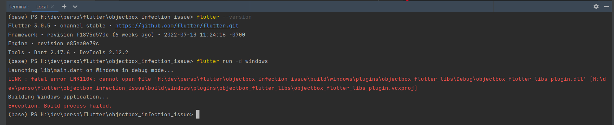

# [Resolved] objectbox_infection_issue

This issue was resolved see [this discussion](https://github.com/objectbox/objectbox-dart/issues/462).

## Requirements
| Item                   | Version                                    |
| ---------------------- | ------------------------------------------ |
| Platform               | Windows 10                                 |
| Flutter                | 3.0.5                                      |
| Bitdefender            | database up to date                        |
| Objectbox dependencies | versions in [pubspec.yaml](./pubspec.yaml) |

## Replicating the issue
1. Execute `flutter pub get`
2. Execute `flutter run -d windows`
3. Notice Bitdefender (Antivirus feature) Report
   

4. Notice error in the console due to the antivirus moving the file into quarantine
   

5. Send the file to VirusTotal for analysis and notice the [report](https://www.virustotal.com/gui/file/e44b13cf2eb654ecc2e71838572b4de3faa6777620f11438c829e9d8f349cf4a?nocache=1)
